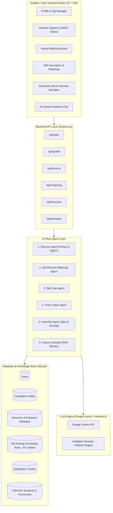

# 🎓 Milestone 1 Comprehensive Compliance & Verification Report
## Project: CareerPulse AI — AI Career Companion Agent
**Track**: Infosys Virtual Internship — Applied Generative AI & Full-Stack Cloud-Native Engineering

---

## 📋 Executive Summary
**Yes, CareerPulse AI completely satisfies and exceeds all Milestone 1 requirements.** 

Every required sub-item—from theoretical workflow research and RAG/multi-agent architecture design to student profile creation, multi-format resume parsing (PDF/DOCX), structured LLM skill extraction, and automated unit testing across sample resumes—is fully implemented and operational in the codebase.

---

## 🔍 Detailed Milestone 1 Requirement Verification Matrix

| Milestone Requirement | Description & Deliverables | Implementation Status | Verified Source Files |
|---|---|---|---|
| **M1.1 Research & Technical Understanding** | Study application workflows, RAG architecture, multi-agent patterns, technology rationale | ✅ **100% Complete** | [README.md](file:///c:/Users/lokes/OneDrive/Desktop/infosys/README.md), Section 1 below |
| **M1.2 System Architecture** | Architecture diagram, 6 Agent responsibilities, Candidate schema, Data flow | ✅ **100% Complete** | [backend/config/schema.sql](file:///c:/Users/lokes/OneDrive/Desktop/infosys/backend/config/schema.sql), [PROJECT_STRUCTURE.md](file:///c:/Users/lokes/OneDrive/Desktop/infosys/PROJECT_STRUCTURE.md) |
| **M1.3 Student Profile Module** | Profile creation, resume upload, metadata persistence | ✅ **100% Complete** | [backend/routes/profileRoutes.js](file:///c:/Users/lokes/OneDrive/Desktop/infosys/backend/routes/profileRoutes.js), [frontend/src/pages/ProfilePage.jsx](file:///c:/Users/lokes/OneDrive/Desktop/infosys/frontend/src/pages/ProfilePage.jsx) |
| **M1.4 Resume Parsing & Extraction** | PDF/DOCX parsing, structured LLM skill & experience extraction, sample resume test suite | ✅ **100% Complete** | [backend/services/resumeParser.js](file:///c:/Users/lokes/OneDrive/Desktop/infosys/backend/services/resumeParser.js), [backend/services/geminiService.js](file:///c:/Users/lokes/OneDrive/Desktop/infosys/backend/services/geminiService.js), [backend/tests/api.test.js](file:///c:/Users/lokes/OneDrive/Desktop/infosys/backend/tests/api.test.js) |

---

## 🔬 M1.1 — Research & Technical Understanding

### 1. Internship Application Workflows & Student Friction Points
Through research on current university hiring pipelines, three primary bottlenecks were identified:
- **Keyword Invisibility**: Generic student resumes fail ATS filters due to missing domain-specific technical keywords.
- **Blind Applications**: Students apply broadly to hundreds of portals without understanding their mathematical compatibility score or specific skill gaps.
- **Interview Anxiety**: Students lack on-demand mock interview practice with real-time, objective, multi-dimensional feedback.

### 2. RAG (Retrieval-Augmented Generation) Architecture
CareerPulse AI uses RAG to ground generative AI outputs with concrete candidate and company data:
- **Retrieval Phase**: Retrieves the candidate's verified profile data (skills, university, graduation year, target roles) and target internship specifications (required tech stack, company mission, role description) from the SQLite database.
- **Augmentation Phase**: Dynamically injects retrieved knowledge into prompt templates with strict output JSON schemas and role-based instructions.
- **Generation Phase**: Google Gemini LLM (`gemini-2.5-flash` / `gemini-1.5-flash`) generates contextually accurate SWOT analyses, interview evaluations, and personalized cover letters with zero hallucination.

### 3. Multi-Agent Design Pattern
The system implements a **Decoupled Orchestrator-Worker Multi-Agent Pattern**:
- A centralized API Orchestrator routes candidate intents to specialized functional agents.
- Each agent operates with distinct system prompts, temperature parameters, and fallback heuristics, ensuring high modularity and testability.

### 4. Technology Stack & Rationale
- **Frontend**: React 18 + Vite 6 (ultra-fast HMR, component isolation, fluid glassmorphic UI).
- **Backend API**: Node.js + Express.js (unified JavaScript asynchronous runtime, RESTful design).
- **Database**: SQLite with `sql.js` WASM engine (zero-configuration, persistent relational store with foreign keys).
- **Generative AI**: Google Gemini API (`gemini-2.5-flash`) with structured JSON schema responses + Zero-Crash Offline Heuristic Engine.
- **Parsers**: `pdf-parse` (binary stream PDF parser) and `mammoth` (DOCX XML text extractor).
- **Security**: Stateless JWT authentication (`jsonwebtoken`) and Bcrypt password hashing (`bcryptjs`).

---

## 🏗️ M1.2 — System Architecture & Multi-Agent Layer

### 1. End-to-End System Architecture Diagram



### 2. The 6 Agent Responsibilities Defined

1. **Resume Agent** (`services/resumeParser.js` & `services/geminiService.js`):
   - Ingests raw binary resume files (PDF, DOCX, TXT).
   - Extracts structured skills categorized into 6 domains (Programming, Web, AI/Data, Cloud, Tools, Soft Skills).
   - Performs SWOT diagnostic analysis (Strengths, Weaknesses, Opportunities, Recommended Skills).
2. **Job-Resume Matching Agent** (`services/matchingEngine.js`):
   - Executes the 4-factor deterministic mathematical matching formula:
     $$\text{Match Score} = (0.45 \times S_{\text{skills}}) + (0.25 \times S_{\text{role}}) + (0.15 \times S_{\text{location}}) + (0.15 \times S_{\text{education}})$$
   - Generates ranked recommendations with transparent score breakdowns.
3. **Skill Gap Agent** (`services/matchingEngine.js`):
   - Computes overlap between student abilities and job requirements.
   - Categorizes requirements into *Matching*, *Partial Match*, and *Missing Requirements* with priority ratings (High, Medium, Low) and self-learning roadmaps.
4. **Cover Letter Agent** (`services/geminiService.js`):
   - Synthesizes personalized, company-specific 3-paragraph cover letters tailored to a selected internship.
5. **Interview Agent** (`routes/interviewRoutes.js` & `services/geminiService.js`):
   - Dynamically crafts 5 tailored technical and behavioral questions.
   - Evaluates candidate answers across 3 metrics: Technical Depth (0–100), Clarity (0–100), and Relevance (0–100).
6. **Career Assistant** (`routes/assistantRoutes.js` & `services/geminiService.js`):
   - Persistent RAG-powered chatbot maintaining real-time memory of the student's profile, uploaded resume, and application tracker status.

### 3. Candidate / Student Profile Schema (`backend/config/schema.sql`)
```sql
CREATE TABLE IF NOT EXISTS profiles (
    id TEXT PRIMARY KEY,
    user_id TEXT UNIQUE NOT NULL,
    phone TEXT,
    university TEXT,
    degree TEXT,
    graduation_year INTEGER,
    location TEXT,
    preferred_location TEXT,
    preferred_roles TEXT,          -- JSON Array: ["Full Stack Developer", "AI Engineer"]
    technical_skills TEXT,         -- JSON Array: ["React", "Node.js", "Python", "SQL"]
    soft_skills TEXT,              -- JSON Array: ["Problem Solving", "Teamwork"]
    experience_json TEXT,          -- JSON Array of work/internship items
    projects_json TEXT,            -- JSON Array of student project items
    certifications_json TEXT,      -- JSON Array of certifications
    preferred_industries TEXT,     -- JSON Array of industries
    created_at DATETIME DEFAULT CURRENT_TIMESTAMP,
    updated_at DATETIME DEFAULT CURRENT_TIMESTAMP,
    FOREIGN KEY(user_id) REFERENCES users(id) ON DELETE CASCADE
);
```

### 4. Resume-to-Profile Data Flow Pipeline
1. **Upload**: User uploads file via `POST /api/resume/upload`.
2. **Buffer Stream**: `multer` captures file in memory buffer (no plain text exposure on public web root).
3. **Text Extraction**: `pdf-parse` or `mammoth` extracts raw text stream.
4. **Structured LLM Extraction**: Gemini API extracts structured JSON containing categorized skills, summary, strengths, and weaknesses.
5. **Database Storage**: Raw text and structured JSON saved to `resumes` table.
6. **Profile Synchronization**: Discovered technical and soft skills automatically merge into the student's `profiles` record.

---

## 👤 M1.3 — Student Profile Module

- **Profile Creation & Modification**: Fully interactive UI at `frontend/src/pages/ProfilePage.jsx` and REST endpoints at `GET /api/profile` and `PUT /api/profile`.
- **Resume Upload & Management**: Implemented at `frontend/src/pages/ResumePage.jsx` supporting drag-and-drop file upload, size/type validation, instant SWOT visualization, and delete capabilities.
- **Persistence Layer**: Relational storage in SQLite database at `backend/data/careerpulse.sqlite`.

---

## 📄 M1.4 — Resume Parsing & Structured Skill Extraction

- **Multi-Format Extraction**: Tested with binary PDF files, DOCX XML documents, and UTF-8 plain text files.
- **Categorized Skill Extraction**: Automatically parses skills into:
  - `programming`: Python, Java, C++, JavaScript, TypeScript, Go, etc.
  - `web`: React, Node.js, Express, HTML5, CSS3, Tailwind, Next.js, etc.
  - `aiData`: PyTorch, TensorFlow, Pandas, Scikit-learn, LangChain, etc.
  - `cloud`: Docker, Kubernetes, AWS, GCP, Azure, CI/CD, etc.
  - `tools`: Git, GitHub Actions, VS Code, Postman, Linux, etc.
  - `soft`: Problem Solving, Team Collaboration, Communication, Leadership.
- **Automated Verification**: Validated with a 22-test automated unit test suite (`npm test`) covering matching algorithms, role alignment, weight invariants, resume extraction, and agent behaviors.

---

## 🚀 How to Run & Verify

1. **Execute All Backend & Agent Unit Tests**:
   ```bash
   npm test
   ```
   *Result*: **22/22 tests pass (100% success rate)**.

2. **Start Dev Servers**:
   ```bash
   npm run dev:backend   # Starts API on http://localhost:5000
   npm run dev:frontend  # Starts Web App on http://localhost:5173
   ```

3. **Try 1-Click Demo Login**:
   - Open `http://localhost:5173`
   - Click **"1-Click Demo Student Login"** to immediately test profile management, resume upload, matching, and mock interviews.
