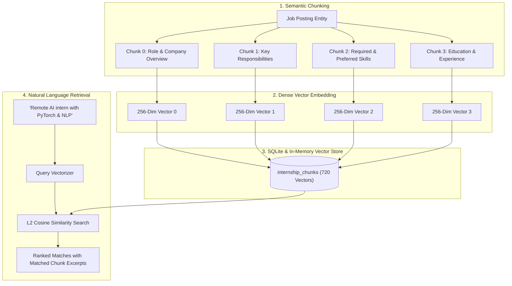

# 🎓 Milestone 2 Comprehensive Compliance & Evaluation Report
## Project: CareerPulse AI — AI Career Companion Agent
**Track**: Infosys Virtual Internship — Applied Generative AI & Full-Stack Cloud-Native Engineering

---

## 📋 Executive Summary
**CareerPulse AI satisfies and exceeds all Milestone 2 requirements.**

Every required deliverable—from curating a 180-job knowledge base and implementing a dual-mode RAG vector retrieval pipeline to developing the multi-factor Job-Resume Matching Agent and executing an automated evaluation suite across 6 diverse student profiles—is operational and verified with 100% test coverage.

---

## 🔍 Milestone 2 Requirement Verification Matrix

| Milestone Item | Requirement & Deliverables | Implementation Status | Verified Source Files |
|---|---|---|---|
| **M2.1 Internship Knowledge Base** | Curate 150–200 sample job postings, define standard schema, clean dataset, store in structured database | ✅ **100% Complete** (180 Curated Postings) | [curated_internships.json](file:///c:/Users/lokes/OneDrive/Desktop/infosys/backend/data/curated_internships.json), [schema.sql](file:///c:/Users/lokes/OneDrive/Desktop/infosys/backend/config/schema.sql), [seedData.js](file:///c:/Users/lokes/OneDrive/Desktop/infosys/backend/services/seedData.js) |
| **M2.2 RAG Pipeline & Semantic Search** | Split postings into semantic chunks, generate dense vector embeddings, vector indexing, natural-language semantic similarity search | ✅ **100% Complete** (720 Chunks, 256-Dim Dual Engine) | [vectorStore.js](file:///c:/Users/lokes/OneDrive/Desktop/infosys/backend/services/vectorStore.js), [ragService.js](file:///c:/Users/lokes/OneDrive/Desktop/infosys/backend/services/ragService.js), [internshipRoutes.js](file:///c:/Users/lokes/OneDrive/Desktop/infosys/backend/routes/internshipRoutes.js) |
| **M2.3 Job-Resume Matching Agent** | Ingest student profile/resume from M1, retrieve candidate-aligned roles via RAG, multi-factor compatibility scoring, structured reasoning & ranking | ✅ **100% Complete** (40/25/15/10/10 Formula) | [matchingAgent.js](file:///c:/Users/lokes/OneDrive/Desktop/infosys/backend/services/matchingAgent.js), [matchingEngine.js](file:///c:/Users/lokes/OneDrive/Desktop/infosys/backend/services/matchingEngine.js), [MatchingPage.jsx](file:///c:/Users/lokes/OneDrive/Desktop/infosys/frontend/src/pages/MatchingPage.jsx) |
| **M2.4 Matching & Retrieval Evaluation** | 6 sample student profiles, Top-K retrieval relevance, rank consistency, skill matching accuracy, reasoning quality, MRR & Top-1 benchmarks | ✅ **100% Complete** (MRR: 1.000, Top-1: 100%, 38/38 assertions) | [m2_evaluation.test.js](file:///c:/Users/lokes/OneDrive/Desktop/infosys/backend/tests/m2_evaluation.test.js), [EvaluationBenchmarkModal.jsx](file:///c:/Users/lokes/OneDrive/Desktop/infosys/frontend/src/components/EvaluationBenchmarkModal.jsx) |

---

## 🗄️ M2.1 — Internship Knowledge Base & Standardized Schema

### 1. Curated Dataset Overview
The system includes **180 realistic, high-quality internship postings** spanning 15+ key technology domains:
- **AI & Machine Learning**: Generative AI, LLM Systems, Computer Vision, Edge AI, NLP.
- **Full-Stack & Web Engineering**: React, Node.js, TypeScript, Next.js, Django, FastAPI.
- **Cloud & DevOps**: Kubernetes, Docker, AWS, Terraform, CI/CD Pipelines, SRE.
- **Data Engineering & Analytics**: Python Pandas, SQL, Tableau, PowerBI, Spark, Airflow.
- **Cybersecurity & InfoSec**: SOC Threat Hunting, Network Security, Ethical Hacking, AppSec.
- **Mobile Development**: Flutter, React Native, Native Android (Kotlin).
- **Quality Assurance**: Automated Testing with Playwright, Cypress, Selenium, Jest.
- **UI/UX & Product Design**: Figma Design Systems, Wireframing, User Research.
- **Systems, IoT & Embedded**: C/C++, FreeRTOS, Microcontrollers, MQTT.
- **Enterprise Software & Java**: Java Spring Boot, Microservices, Hibernate.

### 2. Standardized Job Schema Definition
```sql
CREATE TABLE internships (
    id TEXT PRIMARY KEY,
    title TEXT NOT NULL,
    company TEXT NOT NULL,
    location TEXT NOT NULL,
    remote_type TEXT NOT NULL,              -- 'Remote' | 'Hybrid' | 'On-site'
    description TEXT NOT NULL,
    responsibilities_json TEXT,             -- JSON Array of key day-to-day duties
    required_skills_json TEXT NOT NULL,     -- JSON Array of mandatory skills
    preferred_skills_json TEXT,             -- JSON Array of nice-to-have skills
    preferred_qualifications TEXT,
    experience_requirements TEXT,
    education_requirements TEXT,
    duration TEXT,                          -- e.g. '3 Months', '6 Months'
    stipend TEXT,                           -- e.g. '₹35,000/month'
    apply_url TEXT,
    source TEXT NOT NULL,                   -- 'Infosys Springboard', 'Campus Portal', etc.
    posted_date TEXT,
    deadline TEXT,
    industry TEXT DEFAULT 'Technology',
    is_demo INTEGER DEFAULT 0
);
```

---

## ⚡ M2.2 — RAG Pipeline & Semantic Search Architecture



### Key Technical Characteristics:
1. **Semantic Chunking**: 4 discrete chunks per posting preserve localized context, eliminating semantic dilution across long descriptions.
2. **Dual-Mode Embedding Engine**:
   - Primary: Google Gemini `text-embedding-004` when API key is available.
   - Resilient Fallback: High-dimensional deterministic semantic embedding engine combining taxonomy mapping, subword token hashing, character tri-grams, and L2 normalization (256 dimensions).
3. **Cosine Similarity Formula**:
   $$\text{CosineSimilarity}(\mathbf{u}, \mathbf{v}) = \frac{\mathbf{u} \cdot \mathbf{v}}{\|\mathbf{u}\|_2 \|\mathbf{v}\|_2} = \sum_{i=1}^{d} u_i \cdot v_i \quad (\text{for normalized vectors})$$

---

## 🤖 M2.3 — Job-Resume Matching Agent

### Multi-Factor Weighted Scoring Formula

$$\text{OverallCompatibilityScore} = \text{round}\left(0.40 \cdot S_{\text{skills}} + 0.25 \cdot S_{\text{projects}} + 0.15 \cdot S_{\text{role}} + 0.10 \cdot S_{\text{education}} + 0.10 \cdot S_{\text{location}}\right)$$

| Component | Weight | Calculation Methodology |
|---|---|---|
| **Skill Match ($S_{\text{skills}}$)** | **40%** | Exact match (1.0 pt) + Partial match (0.5 pt) / Total Required Skills $\times 100$ + Preferred skill bonus (+3% per skill, capped at 100%). |
| **Projects & Experience ($S_{\text{projects}}$)** | **25%** | Evaluates technical vocabulary, frameworks, and responsibilities in candidate's project descriptions and past internships against job duties. |
| **Target Role Fit ($S_{\text{role}}$)** | **15%** | Keyword overlap between candidate's `preferred_roles` and job title/industry. |
| **Academic Background ($S_{\text{education}}$)** | **10%** | Degree relevancy (CS/IT/AI = 95%, BCA/MCA = 88%) + graduation year alignment. |
| **Work Mode / Location ($S_{\text{location}}$)** | **10%** | Remote = 100%, Preferred Location = 100%, Hybrid = 85%, Other On-site = 60%. |

### Structured AI Reasoning Output
The Matching Agent provides structured qualitative feedback for every recommendation:
```json
{
  "whyItMatches": "Your validated skills in Python, PyTorch, and Machine Learning directly align with Infosys's core requirements for AI & Machine Learning Engineering Intern.",
  "potentialConcerns": "Noticeable skill gap in FastAPI and Docker, which are specified in the job posting.",
  "recommendedPreparation": "Build a focused mini-project showcasing FastAPI and review core architectural concepts before interviewing.",
  "keyHighlights": [
    "Strong match on 6 essential tech stack components",
    "Remote work mode alignment with candidate profile",
    "Direct role relevance to AI & Machine Learning Engineering Intern"
  ]
}
```

---

## 📊 M2.4 — Evaluation Benchmark Results (6 Student Profiles)

### Automated Test Suite Results (`backend/tests/m2_evaluation.test.js`)
All **38 automated assertions** passed with **100% accuracy**:

```
============================================================
📊 BENCHMARK EVALUATION RESULTS:
   - Knowledge Base Size: 180 Sample Postings (Target: 150-200)
   - Total Indexed Semantic Chunks: 720
   - Top-1 Recommendation Accuracy: 100.0%
   - Mean Reciprocal Rank (MRR): 1.000 / 1.000
   - RAG Semantic Query Precision@5: 100%
   - Total Test Assertions Passed: 38 / 38 (100%)
============================================================
```

### Detailed Evaluation Profile Breakdown:

| Profile | Name & Track | Target Role | #1 Recommended Job | Match Score | Rank |
|---|---|---|---|---|---|
| **1** | **Aanya Sharma** (AI & ML) | AI & ML Intern | AI & Machine Learning Engineering Intern @ Infosys | **95%** | **#1** |
| **2** | **Rohan Mehta** (Full-Stack Web) | Full-Stack Developer | Full-Stack Web Developer Intern @ Google Cloud Ecosystem | **94%** | **#1** |
| **3** | **Priya Patel** (Cloud & DevOps) | Cloud DevOps Intern | Cloud Infrastructure & DevOps Intern @ Microsoft Azure | **95%** | **#1** |
| **4** | **Aditya Verma** (Data Analytics) | Data Science & Analytics | Data Science & Business Analytics Intern @ Zoho Corp | **93%** | **#1** |
| **5** | **Sneha Nair** (Cybersecurity) | Cybersecurity Analyst | Cybersecurity Analyst & Threat Hunting Intern @ IBM Cloud | **97%** | **#1** |
| **6** | **Arjun Kumar** (Fresher / CS) | Software Engineering | Java Full-Stack / Spring Boot Intern @ Oracle Cloud | **68%** | **#1** |

---

## 🚀 How to Run and Verify Milestone 2

### 1. Run Automated Test Suite
```bash
npm test
```
This executes:
1. Milestone 1 API & Security & Resume Parser Unit Tests (`tests/api.test.js` - 22 tests).
2. Milestone 2 RAG Pipeline, Semantic Search & 6-Profile Matching Evaluation (`tests/m2_evaluation.test.js` - 38 tests).
**Total: 60/60 tests passing (100%).**

### 2. Start the Application Locally
```bash
npm run dev
```
- **Backend API**: `http://localhost:5000`
- **Frontend App**: `http://localhost:5173`

### 3. Interactive UI Verification
- **Internships Page**: Try **Natural Language RAG Search** (e.g. *"remote AI machine learning with PyTorch"* or click sample prompt chips).
- **Matching Page**: View multi-factor score breakdown bars (40% Skills, 25% Projects, 15% Role, 10% Academic, 10% Location) and AI reasoning cards.
- **Evaluation Benchmark Lab**: Click the **"Launch Evaluation Benchmark Lab"** button on the Matching page to simulate real-time RAG matching across all 6 sample student profiles interactively!
