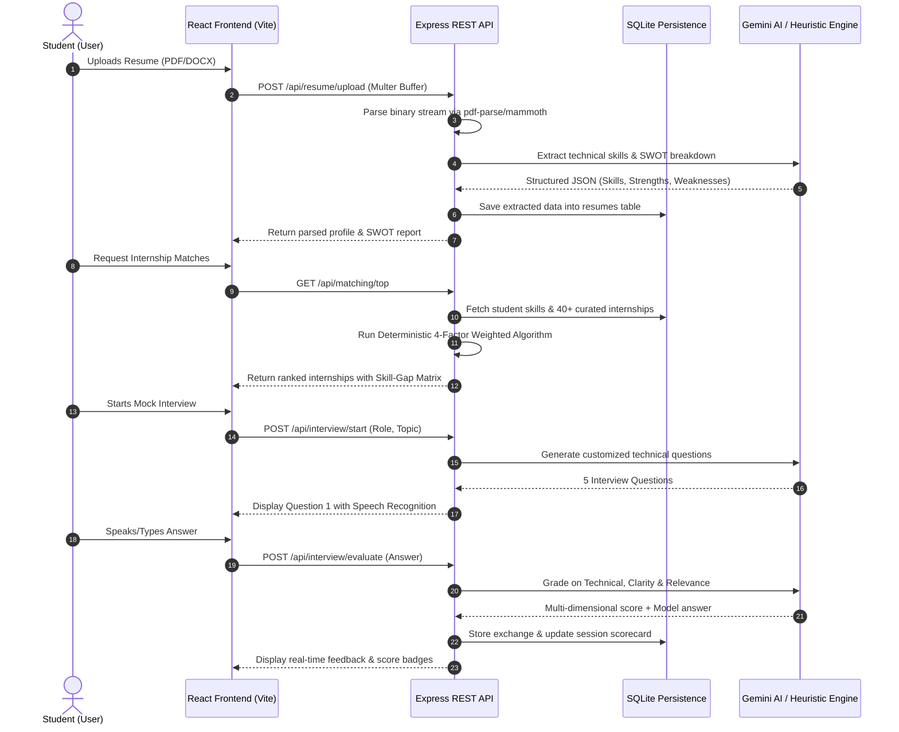

# 🧭 CareerPulse AI — Comprehensive File-by-File Architecture Guide

**CareerPulse AI** is an end-to-end intelligent career companion agent built with a **Node.js/Express Backend (REST API + SQLite + Gemini AI)** and a **React 18 + Vite Frontend**.

---

## 📁 Root Level

* **[package.json](file:///c:/Users/lokes/OneDrive/Desktop/infosys/package.json)**
  * The root orchestrator that contains scripts to start both backend and frontend concurrently or individually (`npm run dev:backend`, `npm run dev:frontend`, `npm test`, `npm start`).
* **[.env.example](file:///c:/Users/lokes/OneDrive/Desktop/infosys/.env.example)**
  * Template configuration defining required environment variables (`PORT`, `JWT_SECRET`, `GEMINI_API_KEY`).
* **[README.md](file:///c:/Users/lokes/OneDrive/Desktop/infosys/README.md)**
  * Complete project documentation, mathematical algorithm specifications, architecture diagrams, and viva Q&A guide.
* **[PROJECT_STRUCTURE.md](file:///c:/Users/lokes/OneDrive/Desktop/infosys/PROJECT_STRUCTURE.md)**
  * Comprehensive file-by-file breakdown and data flow documentation.

---

## 🛠️ Backend Architecture (`backend/`)

```
backend/
├── server.js               # Express application entrypoint
├── config/
│   ├── database.js         # SQLite engine (sql.js) wrapper
│   └── schema.sql          # Database relational schema & tables
├── middleware/
│   ├── auth.js             # JWT verification & token generator
│   └── upload.js           # Multer in-memory binary parser
├── routes/
│   ├── authRoutes.js       # User registration, login & 1-click demo login
│   ├── profileRoutes.js    # Student profile CRUD operations
│   ├── resumeRoutes.js     # Resume upload, parsing & SWOT generation
│   ├── internshipRoutes.js # Internship catalog search, filters & bookmarks
│   ├── matchingRoutes.js   # Deterministic + AI hybrid matching engine
│   ├── interviewRoutes.js  # Interactive mock interview sessions & grading
│   └── assistantRoutes.js  # Context-aware AI career counselor bot
├── services/
│   ├── geminiService.js    # Gemini API wrapper with offline heuristic fallback
│   ├── matchingEngine.js   # 4-variable deterministic matching algorithm
│   ├── resumeParser.js     # PDF and DOCX binary stream parser
│   └── seedData.js         # 40+ pre-seeded live internship catalog
└── tests/
    └── api.test.js         # Automated backend & algorithm test suite
```

### 1. Core Server & Configuration
* **[backend/server.js](file:///c:/Users/lokes/OneDrive/Desktop/infosys/backend/server.js)**
  * Initializes the Express app, configures CORS and JSON body parsers, registers API routes (`/api/*`), connects the SQLite database, triggers seed catalog verification, and starts the HTTP server on port 5000.
* **[backend/config/database.js](file:///c:/Users/lokes/OneDrive/Desktop/infosys/backend/config/database.js)**
  * Encapsulates the `sql.js` (SQLite WASM) database engine. It handles database initialization, runs migrations from `schema.sql`, saves binary data to disk (`backend/data/careerpulse.sqlite`), and exports helper methods: `query()`, `get()`, `run()`, and `save()`.
* **[backend/config/schema.sql](file:///c:/Users/lokes/OneDrive/Desktop/infosys/backend/config/schema.sql)**
  * Defines the database schema:
    * `users`: Authentication records (email, hashed password, name).
    * `profiles`: Academic info, phone, skills, target roles, projects, experience.
    * `resumes`: Extracted text, extracted skills, SWOT analysis JSON.
    * `internships`: Roles, companies, required/nice-to-have skills, stipend, location.
    * `saved_applications`: Student application status tracker.
    * `interview_sessions` & `interview_exchanges`: Mock interview questions, user responses, transcript, and real-time scorecards.
    * `chat_messages`: Conversation history for the AI assistant.

### 2. Middleware
* **[backend/middleware/auth.js](file:///c:/Users/lokes/OneDrive/Desktop/infosys/backend/middleware/auth.js)**
  * Protects private routes using JSON Web Tokens (`Bearer <token>`). Verifies tokens and attaches the authenticated `user_id` to `req.user`. Also exports `generateToken()`.
* **[backend/middleware/upload.js](file:///c:/Users/lokes/OneDrive/Desktop/infosys/backend/middleware/upload.js)**
  * Configures `multer` with in-memory storage buffer. Validates file types (`.pdf`, `.docx`, `.txt`) and restricts file uploads to a max of 5MB.

### 3. Business Services
* **[backend/services/matchingEngine.js](file:///c:/Users/lokes/OneDrive/Desktop/infosys/backend/services/matchingEngine.js)**
  * Implements the **Deterministic Hybrid Matching Algorithm**:
    $$\text{Match Score} = (0.45 \times S_{\text{skills}}) + (0.25 \times S_{\text{role}}) + (0.15 \times S_{\text{location}}) + (0.15 \times S_{\text{education}})$$
  * Generates the **Skill-Gap Matrix** (matching skills, partial overlaps, missing requirements with priority levels and learning roadmaps).
* **[backend/services/geminiService.js](file:///c:/Users/lokes/OneDrive/Desktop/infosys/backend/services/geminiService.js)**
  * Interfaces with the Google Gemini API (`gemini-2.5-flash`, `gemini-1.5-flash`).
  * Features a **Zero-Crash Heuristic Fallback Engine**: If no API key is provided or the network is offline, it activates local deterministic analyzers so that resume SWOT analysis, interview scoring, and assistant responses work seamlessly offline.
* **[backend/services/resumeParser.js](file:///c:/Users/lokes/OneDrive/Desktop/infosys/backend/services/resumeParser.js)**
  * Extracts plain text from binary file buffers using `pdf-parse` (for PDFs), `mammoth` (for DOCX), and string decoding (for TXT).
* **[backend/services/seedData.js](file:///c:/Users/lokes/OneDrive/Desktop/infosys/backend/services/seedData.js)**
  * Populates the database on first boot with 40+ curated tech internship openings across domains (AI/ML, Full Stack, Cloud/DevOps, Data Science, Cyber Security, Mobile).

### 4. API Routes
* **[backend/routes/authRoutes.js](file:///c:/Users/lokes/OneDrive/Desktop/infosys/backend/routes/authRoutes.js)**: `/api/auth` — Register, Login, 1-Click Demo Login (`demo@infosys.com`), and Fetch current session (`/me`).
* **[backend/routes/profileRoutes.js](file:///c:/Users/lokes/OneDrive/Desktop/infosys/backend/routes/profileRoutes.js)**: `/api/profile` — Get and update student career profile and skills.
* **[backend/routes/resumeRoutes.js](file:///c:/Users/lokes/OneDrive/Desktop/infosys/backend/routes/resumeRoutes.js)**: `/api/resume` — Parse uploaded resume, extract skills, and run Gemini AI SWOT analysis.
* **[backend/routes/internshipRoutes.js](file:///c:/Users/lokes/OneDrive/Desktop/infosys/backend/routes/internshipRoutes.js)**: `/api/internships` — Multi-filter search (location, role, stipend, domain) and application status tracker (Saved, Applied, Interviewing, Offered).
* **[backend/routes/matchingRoutes.js](file:///c:/Users/lokes/OneDrive/Desktop/infosys/backend/routes/matchingRoutes.js)**: `/api/matching` — Compute top ranked internship matches and detailed skill-gap breakdown.
* **[backend/routes/interviewRoutes.js](file:///c:/Users/lokes/OneDrive/Desktop/infosys/backend/routes/interviewRoutes.js)**: `/api/interview` — Generate tailored interview questions, evaluate answers across 3 metrics (Technical, Clarity, Relevance), and retrieve past interview transcripts.
* **[backend/routes/assistantRoutes.js](file:///c:/Users/lokes/OneDrive/Desktop/infosys/backend/routes/assistantRoutes.js)**: `/api/assistant` — Interactive career counselor that maintains student profile context.

---

## 💻 Frontend Architecture (`frontend/`)

```
frontend/
├── index.html              # HTML entry point with Google Fonts & Meta tags
├── vite.config.js          # Vite config & API reverse proxy (/api -> localhost:5000)
└── src/
    ├── main.jsx            # React root DOM rendering
    ├── App.jsx             # Main navigation router & view state controller
    ├── index.css           # Modern glassmorphic design system & CSS tokens
    ├── context/
    │   ├── AuthContext.jsx         # Global auth state & token manager
    │   └── NotificationContext.jsx # Toast notification alert system
    ├── components/
    │   ├── Navbar.jsx          # Top navigation bar with active tabs & user chip
    │   ├── Footer.jsx          # Project footer & status indicators
    │   ├── LoadingSpinner.jsx  # Reusable loader component
    │   └── Modal.jsx           # Reusable modal dialog
    ├── pages/
    │   ├── LandingPage.jsx     # Modern landing page & feature overview
    │   ├── AuthPage.jsx        # Login & Signup with 1-Click Demo Login
    │   ├── DashboardPage.jsx   # Student metrics, quick stats & action center
    │   ├── ProfilePage.jsx     # Profile editor & skill tag manager
    │   ├── ResumePage.jsx      # Resume file uploader & AI SWOT viewer
    │   ├── InternshipsPage.jsx # Internship discovery board with live search & filters
    │   ├── MatchingPage.jsx    # Ranked AI match list & compatibility meters
    │   ├── SkillGapPage.jsx    # Visualized skill-gap matrix & learning roadmap
    │   ├── MockInterviewPage.jsx # Interactive AI voice/text mock interview simulator
    │   ├── InterviewHistoryPage.jsx # Past interview scorecards & transcripts
    │   └── AssistantPage.jsx   # Context-aware AI chat counselor
    └── utils/
        └── api.js              # Centralized Axios/Fetch HTTP client
```

### 1. State & Routing
* **[frontend/src/App.jsx](file:///c:/Users/lokes/OneDrive/Desktop/infosys/frontend/src/App.jsx)**
  * Manages the top-level tab routing (`activeTab`), renders current views conditionally, and guards protected tabs behind authentication.
* **[frontend/src/context/AuthContext.jsx](file:///c:/Users/lokes/OneDrive/Desktop/infosys/frontend/src/context/AuthContext.jsx)**
  * Handles user login state, JWT persistence in `localStorage`, demo-login triggers, profile synchronization, and logout.
* **[frontend/src/context/NotificationContext.jsx](file:///c:/Users/lokes/OneDrive/Desktop/infosys/frontend/src/context/NotificationContext.jsx)**
  * Provides non-blocking, modern glassmorphic toast alerts (Success, Error, Info, Warning).

### 2. Pages & Features
* **[frontend/src/pages/LandingPage.jsx](file:///c:/Users/lokes/OneDrive/Desktop/infosys/frontend/src/pages/LandingPage.jsx)**: Hero section with product features, live match metrics, and quick entry into the app.
* **[frontend/src/pages/DashboardPage.jsx](file:///c:/Users/lokes/OneDrive/Desktop/infosys/frontend/src/pages/DashboardPage.jsx)**: Central hub showing profile completion, resume SWOT score, top match recommendation, upcoming mock interviews, and application tracker status.
* **[frontend/src/pages/ResumePage.jsx](file:///c:/Users/lokes/OneDrive/Desktop/infosys/frontend/src/pages/ResumePage.jsx)**: Drag-and-drop resume upload (PDF/DOCX), real-time skill extraction, and AI SWOT analysis (Strengths, Weaknesses, Opportunities, Threats).
* **[frontend/src/pages/MatchingPage.jsx](file:///c:/Users/lokes/OneDrive/Desktop/infosys/frontend/src/pages/MatchingPage.jsx)**: Ranked display of internship matches based on mathematical weights and Gemini insights.
* **[frontend/src/pages/SkillGapPage.jsx](file:///c:/Users/lokes/OneDrive/Desktop/infosys/frontend/src/pages/SkillGapPage.jsx)**: Visualized skill matrix comparing student skills against role requirements, prioritizing missing skills and providing free learning roadmaps.
* **[frontend/src/pages/MockInterviewPage.jsx](file:///c:/Users/lokes/OneDrive/Desktop/infosys/frontend/src/pages/MockInterviewPage.jsx)**: Real-time interactive interview practice with browser Speech-to-Text voice dictation, question generation, and immediate 3D grading.
* **[frontend/src/pages/AssistantPage.jsx](file:///c:/Users/lokes/OneDrive/Desktop/infosys/frontend/src/pages/AssistantPage.jsx)**: Real-time conversational AI mentor with access to the student's resume, skills, and target roles.

### 3. Styling & Networking
* **[frontend/src/index.css](file:///c:/Users/lokes/OneDrive/Desktop/infosys/frontend/src/index.css)**: Comprehensive Vanilla CSS design system containing CSS variables, dark-mode glassmorphic cards, gradients, micro-animations, and responsive breakpoints.
* **[frontend/src/utils/api.js](file:///c:/Users/lokes/OneDrive/Desktop/infosys/frontend/src/utils/api.js)**: Centralized HTTP client that attaches JWT tokens automatically to headers and handles error responses.

---

## 🔄 Data & Execution Flow


