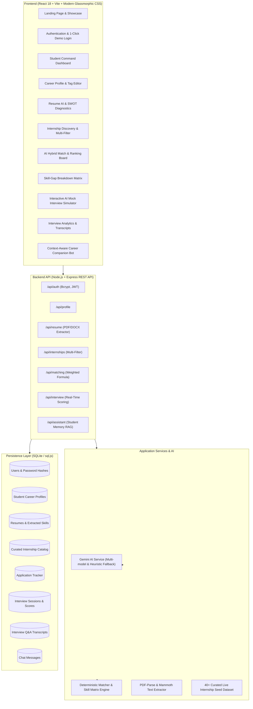

# CareerPulse AI — AI Career Companion Agent for Internship Matching and Interview Preparation

> **Infosys Virtual Internship Capstone Project**  
> *Track: Applied Generative AI & Full-Stack Cloud-Native Engineering*  
> *Environment: Google Antigravity & Google Gemini API*

---

## 📌 Executive Summary & Problem Statement

University students seeking software and AI internships face three primary challenges:
1. **Resume Blindness**: Generic resumes lack targeted alignment with industry expectations and job descriptions.
2. **Opaque Job Matching**: Students apply blindly to hundreds of portals without understanding why they are qualified or which core prerequisites they lack.
3. **Interview Anxiety & Lack of Mentorship**: Access to realistic, personalized technical and behavioral mock interview practice with actionable, constructive feedback is scarce.

**CareerPulse AI** solves this with an intelligent, end-to-end career companion agent that:
- Performs deep **Gemini AI Resume Screening & Competency Extraction** across 6 distinct technical and soft skill domains.
- Uses a **Transparent Hybrid Matching Algorithm** (combining deterministic mathematical weights with semantic AI insights).
- Generates an actionable **Skill-Gap Matrix** (Strong vs. Moderate vs. Missing competencies with priority ratings and learning roadmaps).
- Provides an **Interactive AI Mock Interview Simulator** with voice dictation, real-time multidimensional grading (Technical, Clarity, Relevance), and comprehensive scorecard generation.
- Features a **Context-Aware AI Career Assistant** maintaining persistent student background memory.

---

## 🏗️ System Architecture



---

## 🛠️ Technology Stack

| Layer | Technologies Used | Rationale |
|---|---|---|
| **Frontend** | React 18, Vite 6, Lucide React, Canvas Confetti | Lightning-fast HMR, component modularity, fluid animations |
| **Styling** | Vanilla Modern CSS (Design Tokens, Glassmorphism) | Zero external framework lock-in, custom responsive themes |
| **Backend** | Node.js, Express.js | Unified JavaScript runtime, robust REST API architecture |
| **Persistence** | SQLite (`sql.js` WASM engine) | Zero-configuration file persistence, instant startup |
| **AI / GenAI** | Google Gemini API (`gemini-2.5-flash`, `gemini-1.5-flash`) | Structured JSON outputs, multi-model fallback, zero crash |
| **Parsers** | `pdf-parse`, `mammoth` | Server-side binary buffer parsing for PDF, DOCX, and text |
| **Security** | `bcryptjs` (10 rounds), `jsonwebtoken` (JWT) | Stateless authentication, protected routes, secure password hashing |

---

## 📐 Deterministic Hybrid Matching Formula

Unlike naive apps that pass everything blindly to an LLM, CareerPulse AI implements a transparent, auditable mathematical formula:

$$\text{Overall Match Score} = (0.45 \times S_{\text{skills}}) + (0.25 \times S_{\text{role}}) + (0.15 \times S_{\text{location}}) + (0.15 \times S_{\text{education}})$$

Where:
- $S_{\text{skills}}$: Normalized skill overlap score. Exact match = $1.0$, Partial match = $0.5$, Missing = $0.0$.
- $S_{\text{role}}$: Semantic keyword and domain relevance between student target roles and job title.
- $S_{\text{location}}$: Location and work mode compatibility (Remote = 100%, Hybrid matching = 100%, On-site mismatched = 60%).
- $S_{\text{education}}$: Academic major and graduation year readiness.

---

## 📂 Project Structure

```
infosys/
├── package.json               # Root scripts
├── .env.example               # Template environment configuration
├── backend/                   # Node.js + Express Backend
│   ├── package.json
│   ├── server.js              # Server entry point & database bootstrapper
│   ├── config/
│   │   ├── database.js        # SQLite persistence wrapper
│   │   └── schema.sql         # SQL tables & indexes
│   ├── middleware/
│   │   ├── auth.js            # JWT verification & token generation
│   │   └── upload.js          # Memory buffer Multer configuration
│   ├── routes/
│   │   ├── authRoutes.js      # Register, Login, 1-Click Demo Login, Me
│   │   ├── profileRoutes.js   # Get & Update Student Profile
│   │   ├── resumeRoutes.js    # Upload, Parse, Gemini SWOT Analysis
│   │   ├── internshipRoutes.js# Search, Filter, Bookmark Tracker
│   │   ├── matchingRoutes.js  # Recommendations & Deep-Dive Evaluations
│   │   ├── interviewRoutes.js # Mock Sessions, Real-Time Scoring, History
│   │   └── assistantRoutes.js # Context-Aware Chatbot
│   ├── services/
│   │   ├── geminiService.js   # Gemini API client with offline heuristic fallback
│   │   ├── matchingEngine.js  # Mathematical matching & skill matrix
│   │   ├── resumeParser.js    # PDF & DOCX text extraction
│   │   └── seedData.js        # Curated tech internship catalog
│   └── tests/
│       └── api.test.js        # Automated unit & invariant test suite
└── frontend/                  # React + Vite Frontend
    ├── index.html
    ├── package.json
    ├── vite.config.js
    └── src/
        ├── App.jsx            # Tab router & state manager
        ├── main.jsx           # Root DOM renderer
        ├── index.css          # Design system & glassmorphic styling
        ├── context/
        │   ├── AuthContext.jsx         # Auth session provider
        │   └── NotificationContext.jsx # Toast alerts
        ├── components/
        │   ├── Navbar.jsx
        │   ├── Footer.jsx
        │   ├── LoadingSpinner.jsx
        │   └── Modal.jsx
        ├── pages/
        │   ├── LandingPage.jsx
        │   ├── AuthPage.jsx
        │   ├── DashboardPage.jsx
        │   ├── ProfilePage.jsx
        │   ├── ResumePage.jsx
        │   ├── InternshipsPage.jsx
        │   ├── MatchingPage.jsx
        │   ├── SkillGapPage.jsx
        │   ├── MockInterviewPage.jsx
        │   ├── InterviewHistoryPage.jsx
        │   └── AssistantPage.jsx
        └── utils/
            └── api.js         # Frontend HTTP client
```

---

## 🚀 Quickstart & Running Locally

### Prerequisites
- Node.js (v18 or higher, tested on Node v24)
- npm (v9 or higher)

### 1. Clone & Install Dependencies
```bash
# In the root directory:
cd backend && npm install
cd ../frontend && npm install
```

### 2. Configure Environment Variables
Create `.env` in `backend/` (or copy from `.env.example`):
```env
PORT=5000
JWT_SECRET=careerpulse_secure_jwt_token_secret_key_2026_infosys_project
GEMINI_API_KEY=your_gemini_api_key_here
```
> **Note**: If `GEMINI_API_KEY` is not provided, CareerPulse AI automatically activates its intelligent heuristic fallback engine. The application will run 100% offline without crashing!

### 3. Run Automated Tests
```bash
npm test
```

### 4. Start the Application
Run backend and frontend:
```bash
# Option A: From root directory:
npm run dev:backend   # Terminal 1
npm run dev:frontend  # Terminal 2

# Option B: Direct directories:
# Terminal 1 - Backend API:
cd backend && npm start

# Terminal 2 - Frontend Dev Server:
cd frontend && npm run dev
```
Open **`http://localhost:5173`** in your browser.

---

## 🎓 Infosys Viva & Project Presentation Q&A Guide

### Q1: What is the core problem that CareerPulse AI addresses?
**Answer**: University students frequently struggle with generic resumes, blind applications to hundreds of portals, and lack of actionable interview practice. CareerPulse AI bridges this gap with an end-to-end intelligent platform that screens resumes with Gemini AI, deterministically matches students against real internship competencies, visualizes skill gaps with prioritized learning roadmaps, and conducts interactive mock interviews with real-time scoring.

### Q2: Why did you use a Hybrid Matching Engine instead of letting the LLM calculate the score?
**Answer**: Pure LLM calculations are non-deterministic, expensive, prone to hallucinations, and lack mathematical explainability. We built a hybrid architecture:
- **Deterministic formula**: Computes exact mathematical weights (Skill overlap 45%, Role alignment 25%, Work mode 15%, Academic fit 15%).
- **Gemini LLM**: Used where generative intelligence excels—synthesizing qualitative fit rationale, highlighting hidden applicant advantages, and providing contextual mock interview evaluations.

### Q3: How do you handle resume text extraction securely?
**Answer**: We use in-memory streaming with Multer and server-side parsers (`pdf-parse` for PDFs and `mammoth` for DOCX). The files are never permanently exposed on unprotected web roots. Extracted text is sanitized before structured analysis, and secrets are stored strictly on the server in environment variables.

### Q4: What happens if the Gemini API key is expired or there is no internet connection during viva?
**Answer**: CareerPulse AI has an **Enterprise Heuristic Fallback Engine** built directly into `geminiService.js`. If the Gemini API is unreachable, the system automatically uses domain-specific heuristic analyzers for resume taxonomy extraction, interview questions, answer grading, and chat responses. The application will never crash or hang.

### Q5: How does the AI Mock Interviewer evaluate answers?
**Answer**: The system evaluates responses across three distinct dimensions on a 0–100 scale:
1. **Technical Correctness & Depth**: Did the student explain core concepts and architecture accurately?
2. **Communication & Structure**: Was the answer clear, structured (e.g. STAR method), and concise?
3. **Relevance & Completeness**: Did the candidate answer all sub-parts of the specific question?
It also highlights key concepts mentioned, missed edge cases, and provides a model answer blueprint.

---

## 📄 License & Academic Attribution
This project was developed for the **Infosys Virtual Internship Program**. Built with **Google Antigravity** and the **Google Gemini API**. Licensed under the MIT License.
