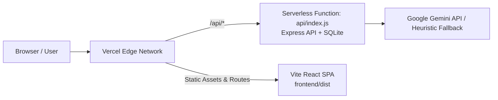

# CareerPulse AI — Vercel Fullstack Deployment Guide

This guide walks you through deploying **CareerPulse AI** (Vite + React Frontend and Node/Express + SQLite Serverless Function Backend) to **Vercel** with zero-configuration serverless routing.

---

## 🏗️ Architecture Overview on Vercel



- **Frontend**: Vite + React single-page application built into `frontend/dist`.
- **Backend**: Express.js REST API executed as a Vercel Serverless Function via `api/index.js`.
- **Database**: In-memory SQLite (`sql.js`) initialized with schema, sample internships, and persisted to `/tmp`.
- **AI Services**: Google Gemini 2.5/2.0/1.5 Flash models with deterministic heuristic offline resilience fallback.

---

## 🚀 Deployment Option 1: Deploy with Vercel CLI (Fastest)

You can deploy directly from your local terminal using `npx vercel`:

### Step 1: Open Terminal in Project Root
```powershell
cd c:\Users\lokes\OneDrive\Desktop\infosys
```

### Step 2: Run Vercel CLI
```powershell
npx vercel
```

### Step 3: Follow the Interactive Prompts
1. **Log in to Vercel**: Press `Enter` to log in via your browser or GitHub account.
2. **Set up and deploy?**: `y`
3. **Which scope?**: Select your personal account or team.
4. **Link to existing project?**: `N` (for first-time deploy) or `y` (if updating an existing project).
5. **What's your project's name?**: `careerpulse-ai` (or your preferred name).
6. **In which directory is your code located?**: `./` (press `Enter`).
7. **Want to modify these settings?**: `N` (settings are automatically detected from `vercel.json`).

### Step 4: Deploy to Production
To promote your preview deployment directly to production:
```powershell
npx vercel --prod
```

---

## 🌐 Deployment Option 2: Deploy via GitHub & Vercel Dashboard

If your repository is pushed to GitHub, GitLab, or Bitbucket:

### Step 1: Push Code to GitHub
```bash
git add .
git commit -m "feat: configure fullstack Vercel deployment with serverless functions"
git push origin main
```

### Step 2: Import into Vercel
1. Go to [vercel.com/new](https://vercel.com/new) and log in.
2. Under **Import Git Repository**, select `AI-Career-Companion-Agent` (or your repository name).
3. In the **Configure Project** screen:
   - **Project Name**: `careerpulse-ai`
   - **Framework Preset**: `Other` (or leave default, `vercel.json` will manage it automatically).
   - **Root Directory**: `./`
   - **Build Command**: `npm run build:frontend` (already specified in `vercel.json`)
   - **Output Directory**: `frontend/dist` (already specified in `vercel.json`)

---

## 🔐 Environment Variables Configuration

Set these environment variables in your Vercel Project Dashboard (**Project Settings > Environment Variables**) or via CLI:

| Variable Name | Required | Default / Description | Example Value |
| :--- | :---: | :--- | :--- |
| `JWT_SECRET` | **Yes** | Secret key for signing and verifying user authentication tokens | `careerpulse_secure_jwt_token_secret_key_2026_infosys_project` |
| `GEMINI_API_KEY` | Optional | Google Gemini API key for live AI analysis (heuristic engine used if not provided) | `AIzaSy...` |
| `NODE_ENV` | Optional | Runtime environment | `production` |

### Setting Environment Variables via Vercel CLI:
```powershell
npx vercel env add JWT_SECRET production
npx vercel env add GEMINI_API_KEY production
```

---

## 🧪 Post-Deployment Verification Checklist

Once Vercel gives you your production deployment URL (e.g. `https://careerpulse-ai.vercel.app`), verify the key features:

- [ ] **Health Check**: Visit `https://your-deployment.vercel.app/api/health` — should return `{"status":"healthy","service":"CareerPulse AI Backend API"}`.
- [ ] **Frontend Loading**: Visit `https://your-deployment.vercel.app` — should render the CareerPulse AI hero landing page.
- [ ] **1-Click Demo Login**: Click **"Try 1-Click Demo"** on the landing page — logs in immediately as Rahul Sharma and opens the Student Dashboard.
- [ ] **Explore Internships**: Navigate to **"Internships"** — filters, remote badges, and pre-seeded internship listings should display.
- [ ] **AI Match Analysis**: Navigate to **"Matching"** — run match compatibility score calculation.
- [ ] **Mock Interview Simulator**: Navigate to **"AI Mock Interview"** — start a session, record/type an answer, and receive real-time scoring and feedback.
- [ ] **Career Assistant**: Navigate to **"AI Assistant"** — ask career/internship questions and receive immediate responses.

---

## 🛠️ Project Configuration Files Reference

- [`vercel.json`](file:///c:/Users/lokes/OneDrive/Desktop/infosys/vercel.json): Vercel routing rules and build settings.
- [`api/index.js`](file:///c:/Users/lokes/OneDrive/Desktop/infosys/api/index.js): Serverless entry point running Express & SQLite.
- [`package.json`](file:///c:/Users/lokes/OneDrive/Desktop/infosys/package.json): Root configuration bundling dependencies for serverless functions and build scripts.
- [`backend/config/database.js`](file:///c:/Users/lokes/OneDrive/Desktop/infosys/backend/config/database.js): Serverless-resilient SQLite storage with `/tmp` caching and in-memory execution.
